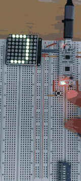

## Introduction

This example demonstrate the use of HT16K33 8X8 Led matrix

## Features

- Simple demo example demonstrating the driver built for [HT16K33 8x8 LED matrix](../../../../embedded-core/src/display_driver/ht16k33_driver.rs)
- Two debounced buttons left and right
- Left button toggles the scroll direction from left/right.
- Right button cycles through animation speed

## Demo

