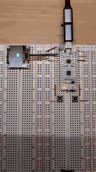

## Introduction

This example demonstrate the use of SSD 1306 display driver

## Features

- Simple demo example demonstrating the driver built for [SSD1306 Display Driver](../../../../embedded-core/src/display_driver/ssd1306_driver/mod.rs)
- Two debounced buttons left and right
- Left button toggles the toggles display from inverted/normal
- Right button cycles pixels illuminated in top-left, top-right, bottom-right, bottom-left
- ADC input to set the contrast of display

## Demo

